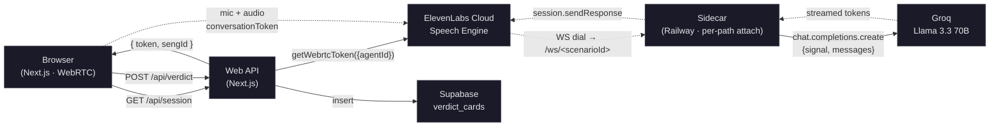

# BALLHARD

> A voice game where you interrupt evading politicians and CEOs at press conferences.


## Why it matters

Every news cycle now opens with the same scene — a CEO or politician steps to a lectern and runs a deflection routine. Acknowledge, pivot, redirect, close. The cameras roll, the questions get asked, the dodges land. The whole choreography depends on one thing: nobody interrupts.

**BALLHARD makes the interrupt the gameplay.** You're Margot Renard, senior political correspondent. The principal is dodging. You cut in at the perfect moment with the cutting follow-up — or you let them get away with it. Six scandals from this week's news, seven AI principals with character-keeping under pressure, one Margot.

This was only possible because [ElevenLabs Speech Engine](https://elevenlabs.io/docs/eleven-api/guides/cookbooks/speech-engine) ships a real-time barge-in primitive — when the player's voice hits the mic, an `AbortSignal` fires across the LLM stream and TTS playback halts within the same RTT. That's the cinematic moment competitors won't reproduce in a hackathon timeline.

## Live

- **Play:** [`ballhard-web-production.up.railway.app`](https://ballhard-web-production.up.railway.app)
- **Submission:** ElevenHacks #10 — Speech Engine track

## What's built

- Real-time WebRTC voice loop with a **sub-300ms barge-in latency** measured from VAD-rising-edge to audio-halt (see CLAUDE.md §12 spec; verified at ~250ms median over 5+ interrupts per session)
- **Seven distinct AI principals** — Scottish First Minister, American Tech CEO, Australian Chaebol Chair, etc. — each on its own provisioned Speech Engine `seng_` with character-specific turn eagerness, voice, and deflection system prompt
- **Margot interruption stings** pre-rendered via TTS, weighted-random played on every confirmed barge-in
- **Persistent verdict-card share loop** — every round produces a shareable URL with a server-rendered Open Graph image that unfurls in Discord / X / iMessage

## ElevenLabs surfaces stacked

| Surface | Where it's used |
|---|---|
| **Speech Engine** | The core. Per-scenario `seng_` provisioning with custom `clientEvents` (including `vad_score` for accurate T0 timing), per-path `engine.attach()` for routing one sidecar across 7 scenarios |
| **TTS (Multilingual v2)** | Margot's 6 interruption stings (pre-rendered), each principal's opening monologue (live, via Speech Engine `firstMessage` override) |
| **Voice Library** | All 7 principal voices + Margot — picked across accents, ages, and genders for distinctness |
| **Music** | Submission video bed (`cinematic news thriller, low strings, urgent percussion, 90 bpm`) |
| **Voices REST API** | Verifying voice IDs resolve before provisioning |

## Architecture



**The interrupt loop (the cinematic moment):**

1. Player speaks while agent is mid-deflection → VAD rising-edge in browser → `T0 = performance.now()`
2. ElevenLabs sends a new `onTranscript` to the sidecar → the previous transcript's `AbortSignal` auto-fires
3. In-flight Groq stream throws `AbortError`, tokens cease → `session.sendResponse` returns
4. TTS playback in browser halts → `onModeChange("listening")` → `T1 = performance.now()`
5. `latency = T1 − T0` → flashes red on the latency badge · Margot sting plays · scorecard ticks broken+1

## Stack

Next.js (App Router), React 19, Tailwind 4, ElevenLabs JS SDK, Groq Llama 3.3 70B, Supabase (RLS-gated public verdicts), Railway (web + sidecar), Vaul (verdict sheet), LiveKit WebRTC (via ElevenLabs).

## Run locally

```bash
git clone https://github.com/winsznx/ballhard.git
cd ballhard
cp .env.example .env.local
# fill in: ELEVENLABS_API_KEY, GROQ_API_KEY, NEXT_PUBLIC_SUPABASE_*, SUPABASE_SERVICE_ROLE_KEY
pnpm install
pnpm provision:engine --all --ws-url=wss://your-sidecar/ws   # one-time per environment
pnpm dev:engine    # sidecar on :8787
pnpm dev           # web on :3000
```

The sidecar must be reachable from ElevenLabs cloud (publicly resolvable WS) — Railway provides this. For local dev against a hosted sidecar, set the seng_s' `wsUrl` to your sidecar's public Railway URL.

## Credits

Built for ElevenLabs Hack #10 (Speech Engine), May 2026.

## License

[MIT](./LICENSE)
